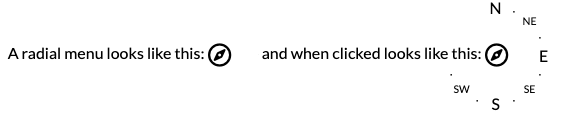

# Radial menu and radial list
_A pure CSS library for inline lists and menus around a circle, flexible and customizable_

A _radial layout_ organizes a list of items in a circle around a central element called _pivot_. _Radial lists_ always show the items around the pivot, while _radial menus_ use the pivot as a clickable toggle button to show and hide the items. Both lists and menus can be placed inline next to the boxes of other elements and text strings. Both the central pivot and the individual items can contain icons, text and labels, and can be hypertext links. 

## What is a radial menu?

It looks like an icon or a small text (or anything with a square or circular look) that when clicked opens into a circular menu of options, either a full circle or a small list of items. 

## How to use it

Download and include in your HTML page the radialMenu.css file, and create a menu with the following code: 

	  	

			<input id="radialMenu" type="checkbox">
			<label class="radialPivot" for="radialMenu">
				
				Show menu items
			</label>
			<ul class="radialList compass" role="navigation" aria-label="menu items">
				<li class="icon"><a href="javascript:alert(`Go North`)">N</a></li>
				<li class="f1"><a href="javascript:alert(`Go North North East`)">&#183;</a></li>
				<li class="f1"><a href="javascript:alert(`Go North East`)">NE</a></li>
				<li class="f1"><a href="javascript:alert(`Go East North East`)">&#183;</a></li>
				<li class="icon"><a href="javascript:alert(`Go East`)">E</a></li>
				<li class="f1"><a href="javascript:alert(`Go East South East`)">&#183;</a></li>
				<li class="f1"><a href="javascript:alert(`Go South East`)">SE</a></li>
				<li class="f1"><a href="javascript:alert(`Go South South East`)">&#183;</a></li>
				<li class="icon"><a href="javascript:alert(`Go South`)">S</a></li>
				<li class="f1"><a href="javascript:alert(`Go South South hWest`)">&#183;</a></li>
				<li class="f1"><a href="javascript:alert(`Go South West`)">SW</a></li>
				<li class="f1"><a href="javascript:alert(`Go West South West`)">&#183;</a></li>
			</ul>
		

and you're good to go. 

## Documentation

You can look at some extensive documentation and showcase at http://www.fabiovitali.it/radial/

## Licence

This CSS library is subject to the terms of the Mozilla Public License, v. 2.0. See http://mozilla.org/MPL/2.0/. Additionally, inclusions of this library, modified or not, in packages and libraries for web development is possible under an agreement with the copyright holders.
